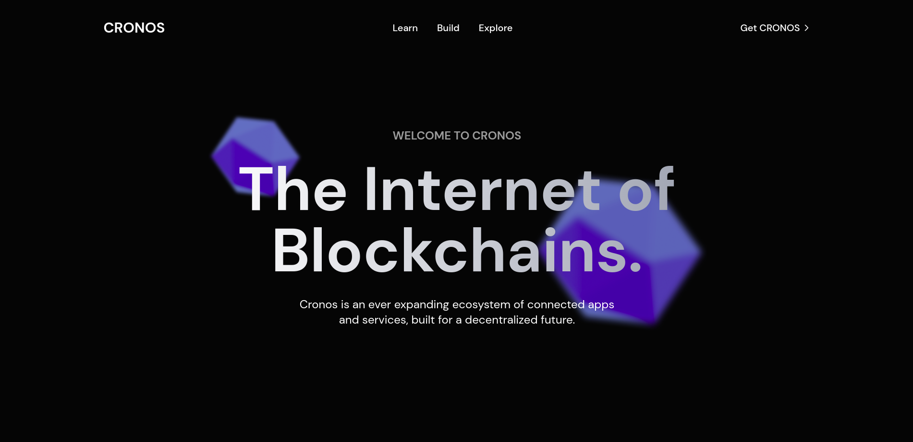

<h2 align="center">Web3 Landing Page</h2>



## Introdução

- Landing Page construída com Next.js e Tailwind CSS, adaptada para todos os dispositivos.
- Layout base: [Clique aqui para acessar no Figma.](https://www.figma.com/file/ZSSEuOWL2CERCeXH84tqMs/Web3-Landing-Page?node-id=102%3A170&t=5yf5wdlf4Gtj2jHZ-1)

## Tutorial de acesso

Para visualizar a landing page, você pode acessar [este link]() ou clonar o projeto em sua máquina:

```
git clone git@github.com:luccarauedys/desafio-frontend-sonica.git
```

Após clonar, entre na pasta e instale as dependências:

```
npm install
```

Por fim, rode a aplicação:

```
npm run dev
```

## Tecnologias utilizadas

- [Next JS](https://nextjs.org/docs)
- [TypeScript](https://www.typescriptlang.org/docs/)
- [Tailwind CSS](https://tailwindcss.com/)
- [Phosphor Icons](https://phosphoricons.com/)
- [AOS](https://michalsnik.github.io/aos/)
